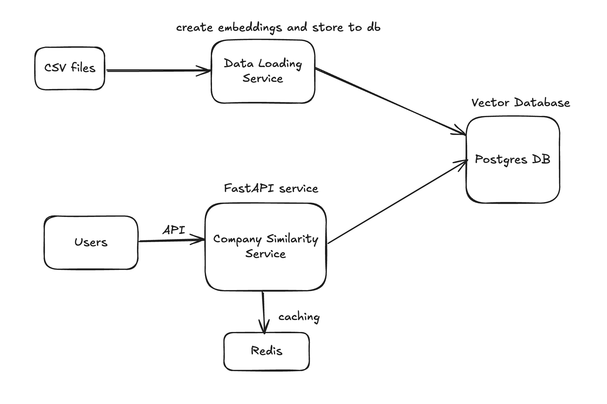
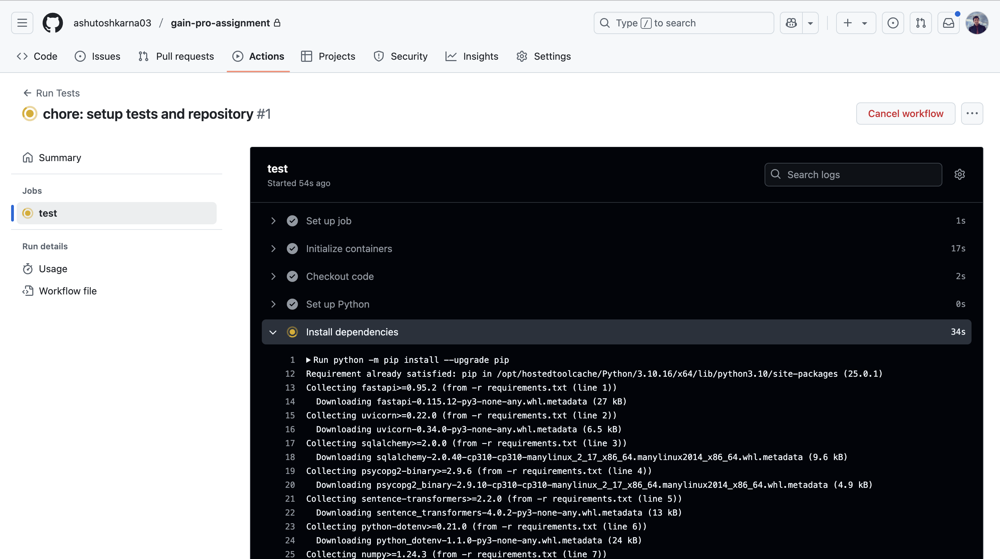
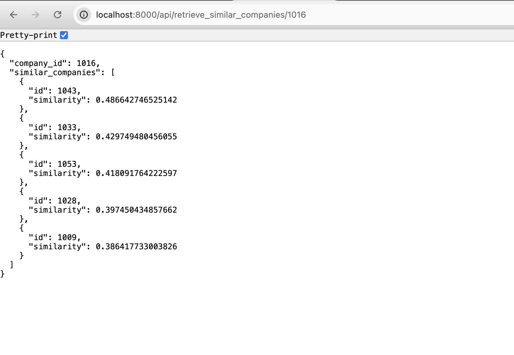
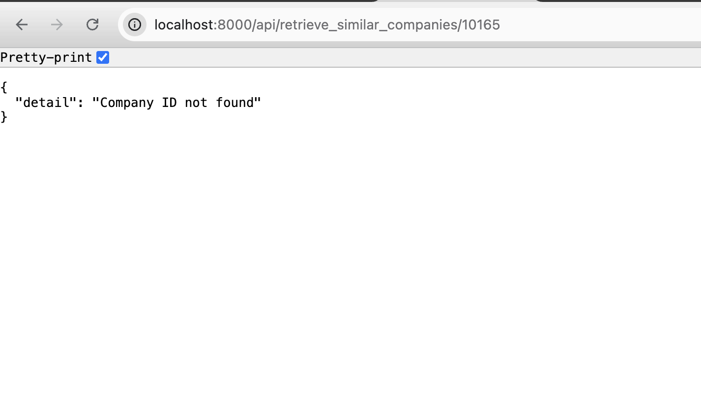
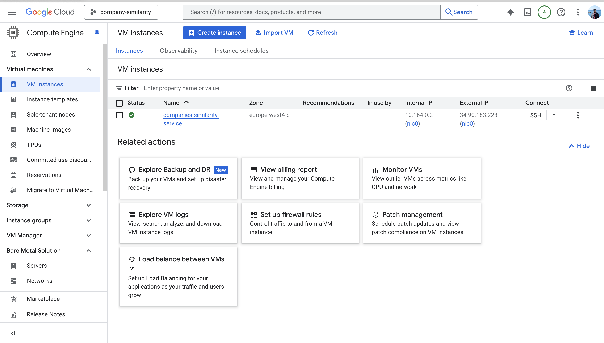

# **Company Similarity Retrieval Service**

## **Overview**
This project implements a Python-based service to retrieve and rank companies similar to a given target company. The similarity is determined using textual embeddings stored in PostgreSQL with the pgvector extension. The service uses machine learning techniques, specifically embeddings generated by Sentence-BERT, to measure similarity and provides results via a RESTful API.

---

## **Features**
1. **Data Preprocessing**:
   - Merge multiple CSV files (`companies.csv`, `company_industries.csv`, `company_specialities.csv`) into a unified dataset.
   - Clean and normalize textual data.
2. **Embedding Generation**:
   - Use a pre-trained Sentence-BERT model to generate embeddings for company descriptions.
   - Store embeddings in PostgreSQL with pgvector extension.
3. **Similarity Computation**:
   - Perform similarity search directly in PostgreSQL using the `&lt;=&gt;` operator for cosine similarity.
4. **Redis Caching**:
   - Cache API responses to improve performance and reduce database load.
5. **Modular Codebase**:
   - Repository pattern for database queries.
   - Separate routers for API endpoints.
6. **Continuous Integration**:
   - Automated testing using GitHub Actions.

---

## **Technologies Used**
- **Programming Language**: Python
- **Libraries**:
  - `fastapi`: API development
  - `sqlalchemy`: Database interaction
  - `sentence-transformers`: Embedding generation
  - `psycopg2-binary`: PostgreSQL driver
  - `fastapi-redis-cache`: Redis caching
  - `pytest`: Testing framework
  - `sqlalchemy-utils`: Database utilities
- **Database**: PostgreSQL with pgvector extension
- **Caching**: Redis
- **Containerization**: Docker
- **CI/CD**: GitHub Actions

---

## **Setup Instructions**

### **1. Clone the Repository**
```

git clone <repository-url>
cd project

```

### **2. Install Dependencies**
Create a virtual environment and install required Python packages:
```

python3 -m venv venv
source venv/bin/activate
pip install -r requirements.txt

```

### **3. Start Services**
Run the following command to start PostgreSQL, Redis, and the FastAPI application:
```

docker-compose up --build

```

### **4. Load Data into PostgreSQL**
Run the script to load data and generate embeddings:
```

python load_data_to_postgres.py

```

### **5. Access the API**
Use tools like Postman or CURL to interact with the API:
- Endpoint: `/api/retrieve_similar_companies/{company_id}`
- Example Request:
```

curl http://localhost:8000/api/retrieve_similar_companies/1009

```
- Example Response:
```

{
"company_id": 1009,
"similar_companies": [
{"id": 1016, "similarity": 0.89},
{"id": 1023, "similarity": 0.87},
{"id": 1032, "similarity": 0.85}
]
}

```

---

### Architecture Diagram



---

## **Directory Structure**
```

project/
├── app/
│   ├── main.py              \# Entry point for FastAPI application
|   ├── models/
|   |   ├── company.py       \# Pydantic Models 
|   |   └── __init__.py
│   ├── routers/
│   │   ├── company.py       \# Router file for company-related APIs
│   │   └── __init__.py      \# Makes `routers` a Python package
│   ├── repositories/
│   │   ├── company.py       \# Repository file for company-related database queries
│   │   └── __init__.py      \# Makes `repositories` a Python package
│   ├── database.py          \# Database connection setup
│   └── __init__.py          \# Makes `app` a Python package
├── data/
│   ├── companies.csv        \# Company data
│   ├── company_industries.csv \# Industry mapping
│   ├── company_specialities.csv \# Specialities mapping
├── tests/                   \# Unit tests for repositories and routers
├── load_data_to_postgres.py \# Script for loading data into PostgreSQL
├── requirements.txt         \# Python dependencies
├── docker-compose.yml       \# Docker Compose setup for services (PostgreSQL + Redis + FastAPI)
├── .github/workflows/tests.yml \# GitHub Actions workflow for CI/CD testing pipeline
└── README.md                \# Project documentation (this file)

```

---

## **Testing Instructions**

### Run Unit Tests Locally:
Install `pytest` and run tests:
```

pytest tests/ --maxfail=5 --disable-warnings -v

```

### Continuous Integration with GitHub Actions:
- Automated testing is configured in `.github/workflows/tests.yml`.
- Tests are triggered on every push or pull request targeting the `main` branch.

---

## **API Documentation**

### Endpoint: `/api/retrieve_similar_companies/{company_id}`
#### Request:
- Method: `GET`
- URL Parameter: `company_id` (integer)

#### Response:
```

{
"company_id": <target_company_id>,
"similar_companies": [
{
"id": <similar_company_id>,
"similarity": <similarity_score>
},
...
]
}

```

---

## **GitHub Actions Workflow**

The CI pipeline runs tests automatically using GitHub Actions.

#### Workflow File: `.github/workflows/tests.yml`



## Screenshots

### API Response Example

---

---

### Project Structure


---

## **Future Improvements**
1. Add filtering capabilities (e.g., filter by industry or location).
2. Implement caching invalidation strategies for dynamic data updates.
3. Scale PostgreSQL horizontally using partitioning or sharding.
4. Add monitoring with grafana or new relic
5. Env variables management
6. Logger implementation
7. Security measurements
8. IaaC for Google cloud, for ex: terraform

---

